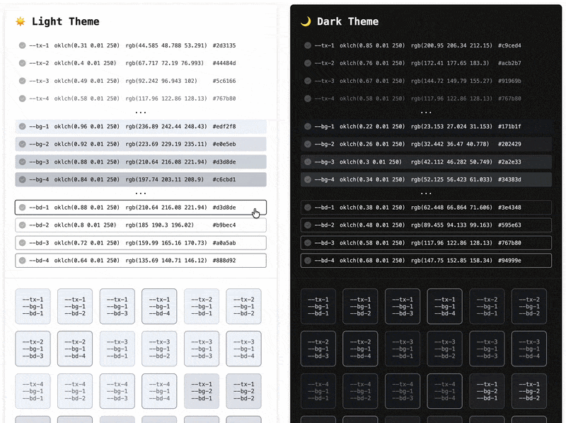

<p align="center">
    <picture>
        <source media="(prefers-color-scheme: dark)" srcset="./preview/icon-dark.svg">
        
    </picture>
</p>

<h1 align="center">LightStair CSS</h1>

<p align="center">
    <a href="README.ko.md">한국어</a> ·
    <a href="README.md">English</a>
</p>

<p align="center">
    
</p>

<p align="center">
    OKLCH 색상 공간을 기반으로 글자·배경·테두리 색의 밝기 단계를 설정하여 CSS 파일을 생성하는 CLI 도구.
</p>

<p align="center">
    
</p>

---

## 이 도구가 필요한 이유

CSS에서 특정 색상의 밝기를 여러 단계로 선언해 두고 사용하고 싶을 때가 있습니다. 하지만 똑같은 밝기라도 글자·배경·테두리 색은 서로 다른 밝기 단계로 설정해야 합니다. 또한, 글자·배경·테두리 색의 조합도 맞춰봐야 하고 다크 모드까지 고려해야 합니다. 이 도구는 이러한 과정을 도와줍니다.

## 기능 소개

- OKLCH 색상 공간 기반 설정
- OKLCH, RGB, HEX 색상 값으로 내보내기
- 다크 모드 지원
- 로컬 서버 미리보기 제공
  - 글자색 × 배경색 × 테두리색 조합 기능
  - 라이트/다크 테마 같이 보기

## 설치

```bash
npm install lightstair-css
```

## CLI

### 도움말

```bash
lightstair-css --help
```

### 설정 파일 생성

```bash
lightstair-css init
```

실행 위치에 기본 [lightstair-css.yml](./templates/lightstair-css.yml) 설정 파일을 생성합니다. 설정 파일이 이미 존재하면 무시합니다.

### CSS 파일 생성

```bash
lightstair-css [options]
```

기본으로 실행 위치에 `lightstair-css.css` 파일을 생성합니다. 실행 위치에 설정 파일이 없는 경우 기본 설정 파일이 자동으로 생성됩니다.

기본 포맷은 `OKLCH`이며 생성된 CSS 변수들의 색상 값은 동적으로 계산하는 코드로 생성됩니다. `--bake [format]` 옵션을 사용하면 계산된 색상 값으로 CSS를 생성할 수 있습니다.

```css
/* 기본 코드 */
--tx-1: oklch(clamp(0, var(--tx-init-l) + var(--tx-l-gap) * 0, 1) var(--tx-base-c) var(--tx-base-h));

/* `--bake oklch` 옵션으로 계산된 코드 */
--tx-1: oklch(0.31 0.01 250);

/* `--bake rgb` 옵션으로 계산된 코드 */
--tx-1: rgb(44.585 48.788 53.291);

/* `--bake hex` 옵션으로 계산된 코드 */
--tx-1: #2d3135;
```

### 미리보기 서버 실행

```bash
lightstair-css preview [options]
```

브라우저에서 `http://localhost:[port]`로 접속하면 미리보기 화면을 확인할 수 있습니다. 옵션으로 포트 번호를 명시하지 않으면 임의의 포트로 실행됩니다.

### 명령어 예시

```bash
# 도움말
lightstair-css --help

# 기본 설정 파일 생성
lightstair-css init

# 기본 설정으로 CSS 파일 생성
lightstair-css

# 설정 파일과 출력 파일 지정
lightstair-css -c my-config.yml -o dist/my-colors.css

# 계산된 RGB 포맷으로 CSS 파일 생성
lightstair-css --bake rgb

# 계산된 HEX 포맷으로 CSS 파일 생성 및 출력 파일 지정
lightstair-css --bake hex -o dist/my-colors.css

# 미리보기 서버 시작
lightstair-css preview

# 포트 및 설정 파일을 지정하여 미리보기 서버 시작
lightstair-css preview -p 3000 -c my-config.yml
```

## API

CLI 외에도 JavaScript 코드에서 직접 사용할 수 있습니다.

### 설정 파일 읽기

```js
import { buildConfig } from 'lightstair-css';

const config = buildConfig('./lightstair-css.yml');
```

YAML 설정 파일을 읽어서 기본값이 모두 채워진 설정 객체를 반환합니다.

### CSS 생성

```js
import { generateCSS } from 'lightstair-css';

const css = generateCSS(config);
```

설정 객체를 기반으로 CSS 문자열을 생성합니다. 동적으로 계산되는 CSS 변수 코드가 생성됩니다.

### Bake된 CSS 생성

```js
import { generateBakedCSS } from 'lightstair-css';

const css = generateBakedCSS(config, 'oklch'); // 또는 'rgb', 'hex'
```

계산된 실제 색상 값이 이미 포함된 CSS를 생성합니다. `--bake` CLI 옵션과 동일합니다.

### 색상 변수 객체 생성

```js
import { generateColorVars } from 'lightstair-css';

const colorVars = generateColorVars(config);
```

라이트/다크 테마별 색상 값을 포함하는 객체를 반환합니다.

```js
// 반환 예시
{
    '--tx-1': { light: { oklch: '...', rgb: '...', hex: '...' }, dark: { ... } },
    '--bg-1': { light: { ... }, dark: { ... } },
    '--bd-1': { light: { ... }, dark: { ... } },
}
```

### 전체 예시

```js
import * as LightstairCss from 'lightstair-css';

// 1. 설정 파일 읽기
const configPath = './lightstair-css.yml';
const config = LightstairCss.buildConfig(configPath);

// 2. CSS 생성
const css = LightstairCss.generateCSS(config);

// 3. 파일로 저장
import { writeFileSync } from 'node:fs';
writeFileSync('./colors.css', css);
```
