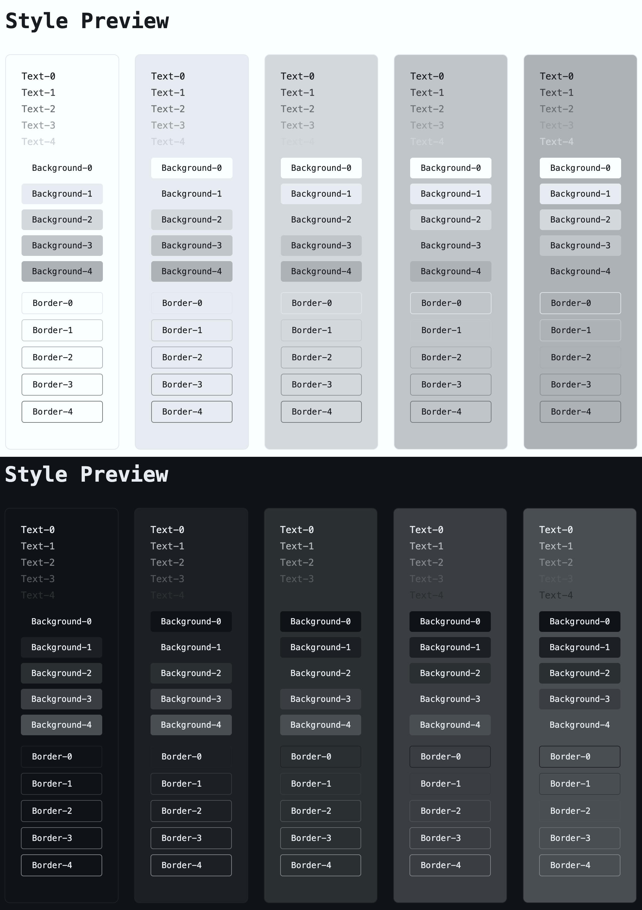

# LightStair CSS

글자색, 배경색, 테두리색의 단계별 밝기를 CSS 코드로 생성하는 CLI 패키지

[](https://www.npmjs.com/package/lightstair-css)
[](https://nodejs.org/)
[](LICENSE)

## 설치

```bash
npm install lightstair-css
```

## CLI 명령어

### 기본 실행

```bash
lightstair-css [options]
lightstair [options]
```

### 도움말

```bash
lightstair-css --help
```

### `init` — 설정 파일 생성

```bash
lightstair-css init
```

현재 디렉토리에 기본 [lightstair-css.yml](./templates/lightstair-css.yml) 설정 파일을 생성합니다. 이미 존재하면 무시합니다.

### `preview` — 미리보기 서버

```bash
lightstair-css preview [options]
```

### 명령어 예시

```bash
# 기본 설정 파일 생성
lightstair-css init

# 기본 설정으로 CSS 생성
lightstair-css

# 설정 파일과 출력 위치 지정
lightstair-css -c my-config.yml -o dist/my-colors.css

# 계산된 RGB 값으로 변환
lightstair-css --bake rgb

# 출력 위치 지정과 계산된 16진수 값으로 변환
lightstair-css -o dist/my-colors.css --bake hex

# 설정 파일 지정과 미리보기 서버 시작 (포트 3000)
lightstair-css -c my-config.yml preview -p 3000
```

### 미리보기 화면 예시


